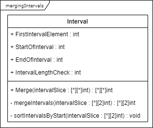

# mergingIntervals
Coding Task 2 - Merge - Ugur Gündüz

MergingIntervals is a simple tool which is able to return a merged slice of overlapping intervals in Golang.

## Definition (Assumptions & Constraints)
An interval is defined as an integer-slice containing only start and endpoints [start, end].
- Therefore the length of a single interval == 2
- The length of the slice of intervals == 0 &le; lengthOfSlice &le;  2<sup>64-1</sup>

A startpoint and an endpoint is defined as:
- start &le; end 
- -2<sup>64-1</sup> &le; start &le; 2<sup>64-1</sup>,
- -2<sup>64-1</sup> &le; end &le; 2<sup>64-1</sup>

-2<sup>64-1</sup> is the minimum integer value in Golang.

2<sup>64-1</sup> is the maximum integer value in Golang.

## UML-Class Diagram

## Prerequisites
- A system running any linux distribution
- Golang (Recommended Version: latest - 1.17)
- Git
- Internet Connection

## Installation
### Install automatically
```
chmod +x installation.sh
./installation.sh <your-project-directory-path-where-mergingIntervals-will-be-used>
```

### Install manually
```
$ mkdir -p $GOPATH/src/github.com/UgurTheG/mergingIntervals/
$ cd $GOPATH/src/github.com/UgurTheG/mergingIntervals/
$ git clone git@github.com:UgurTheG/mergingIntervals.git
```


Next, change your directory to the directory of your own project. Then use the `go get`-command so that the mergingIntervals library will be added to your go.mod file
```
$ cd <your-project-directory-path>
$ go get github.com/UgurTheG/mergingIntervals
```
## Usage
As the mergingIntervals repository is pulled from GitHub we simply import the mergingIntervals library to our custom project as follows:
```go
package main

import (
	"fmt"
	"github.com/UgurTheG/mergingIntervals"
)

func main() {
	intervalStruct := mergingIntervals.Interval{}
	intervalSlice := [][]int{{25, 30}, {2, 19}, {14, 23}, {4, 8}}
	mergedIntervals := intervalStruct.Merge(intervalSlice)
	fmt.Println(mergedIntervals)
}
```

Finally, as we execute the program we will get a valid result:

```shell
master:~ # go run main.go
[[2 23] [25 30]]
```

## Testing

mergingIntervals was tested using go unit-tests. 
If you wish to execute the test-cases:

```
$ cd $GOPATH/src/github.com/UgurTheG/mergingIntervals/
$ go test -cover .
```

